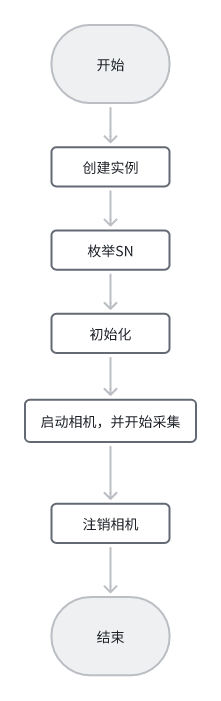

# C# MG.CamCtrl 工业相机库(开源) 海康(HIK) 大恒(DHeng) 巴斯勒(Basler)

 --- 

### 创作不易，请:tw-2b50:支持

## 介绍

c# 工业相机库，含海康(HIK)、大恒、巴斯勒(Basler)等相机的常用功能。
接口统一，底层采用回调+信号量模式封装 ，最大程度减小线程资源，提高采图效率。


## 进度

**（功能持续完善中）**

  ****2025-02-10****

1. 添加巴斯勒相机品牌(Basler)

2. 接口优化

3. 其他细节优化 
   
   ****2025-01-09****

4. 海康相机(HIK)增加USB类型相机 

5. 解决HIK内存占用过高问题 

6. 其他细节优化 

## 快速开始

注意：目标平台设置： x64

如果需要其他平台，请将引用的所有相机dll更新为对应的平台

### 使用流程



### 1. 工厂模式创建实例

```csharp
ICamera myCamera;
myCamera= CamFactory.CreatCamera(CameraBrand.HIK);//CameraBrand.DaHeng | CameraBrand.Basler
```

### 2. 枚举SN

```csharp
 //获取相机枚举
var devicelist = myCamera.GetListEnum();
//or
//var devicelist = CamFactory.GetDeviceEnum(CameraBrand.HIK); 
```

### 3. 初始化

```csharp
//选对应SN,初始化相机 
myCamera.InitDevice(devicelist.First());
```

### 4. 启动相机，并开始采集

启动相机有以下几种方式：

- 循环采图模式 
- 常规硬触发 
- 常规软触发
- 硬触发  +   回调
- 软触发 + 回调

```csharp
//循环采图模式   启动相机
myCamera.StartWith_Continue(CameraCallBack); 

//硬触发模式  启动相机
//myCamera.StartWith_HardTriggerModel(HardTriggerModel.Line0); 
//硬触发 + 回调模式  启动相机
//myCamera.StartWith_HardTriggerModel(HardTriggerModel.Line0,CameraCallBack); 

//软触发模式  启动相机
//myCamera.StartWith_SoftTriggerModel(); 
//软触发 + 回调模式  启动相机
//myCamera.StartWith_SoftTriggerModel_SetCallback(CameraCallBack); 
```

回调函数：

```csharp
/// <summary>
/// 回调函数
/// </summary>
/// <param name="bmp"></param>
private void CameraCallBack(Bitmap bmp)
{

    //执行取图后的操作
    bmp.Save("./test.bmp");
}
```

### 5.取图

> 为了能兼容其他视觉平台，图像格式为Bitmap  
> 这样无论是OpenCV Halcon VisionPro 都可任意转换想要的格式

```csharp
//等待硬触发 获取图片, 设定超时：5000ms
myCamera.GetImage(out Bitmap CaptureImage,3000);
//or 使用默认超时时间
//myCamera.GetImage(out Bitmap CaptureImage);

//软触发获取图像
//myCamera.GetImageWithSoftTrigger(out Bitmap CaptureImage);

/// <summary>
/// 回调函数
/// </summary>
/// <param name="bmp"></param>
private void CameraCallBack(Bitmap bmp)
{
    //执行取图后的操作
    bmp.Save("./test.bmp");
}
```

### 6. 注销相机

```csharp
//注销当前实例
myCamera.CloseDevice();
////or
//CamFactory.DestroyCamera(myCamera);
////or
//CamFactory.DestroyAll();   
```

## 接口

### 1. 相机操作

| 接口                             | 描述       |
|:------------------------------ |:--------:|
| List < string  > GetListEnum() | 获取相机SN枚举 |
| bool InitDevice(string CamSN)  | 初始化相机    |
| void CloseDevice()             | 注销相机     |

### 2. 启动方式

| 接口                                                                                            | 描述                |
|:--------------------------------------------------------------------------------------------- | ----------------- |
| bool StartWith_Continue(Action<Bitmap> callbackfunc)                                          | 回调 + 循环采图 启动相机    |
| bool StartWith_SoftTriggerModel(Action<Bitmap> callbackfunc = null)                           | 软触发模式(回调可选用)启动相机  |
| bool StartWith_HardTriggerModel(TriggerSource hardsource, Action<Bitmap> callbackfunc = null) | 硬触发模式(回调可选用) 启动相机 |

### 3. 取图

| 接口                                                                  | 描述        |
| ------------------------------------------------------------------- | --------- |
| bool GetImage(out Bitmap bitmap, int outtime = 3000)                | 等待硬触发获取图像 |
| bool GetImageWithSoftTrigger(out Bitmap bitmap, int outtime = 3000) | 软触发获取图像   |
| bool SoftTrigger()                                                  | 软触发       |
| 回调取图（详情见案例）                                                         |           |

### 4. 相机参数配置

| 接口                                                                                     | 描述            |
| -------------------------------------------------------------------------------------- | ------------- |
| void SetCamConfig(CamConfig config)                                                    | 设置相机参数        |
| void GetCamConfig(out CamConfig config)                                                | 获取相机参数        |
| bool SetTriggerMode(TriggerMode mode, TriggerSource triggerEnum = TriggerSource.Line0) | 设置触发模式及触发源    |
| bool GetTriggerMode(out TriggerMode mode, out TriggerSource hardTriggerModel)          | 获取触发模式及触发源    |
| bool SetExpouseTime(ushort value)                                                      | 设置曝光时长        |
| bool GetExpouseTime(out ushort value)                                                  | 获取曝光时长        |
| bool SetTriggerPolarity(TriggerPolarity polarity)                                      | 设置硬触发极性       |
| bool GetTriggerPolarity(out TriggerPolarity polarity)                                  | 获取硬触发极性       |
| bool SetTriggerFliter(ushort flitertime)                                               | 设置触发滤波时间 （us） |
| bool GetTriggerFliter(out ushort flitertime)                                           | 获取触发滤波时间 （us） |
| bool SetTriggerDelay(ushort delay)                                                     | 设置触发延时        |
| bool GetTriggerDelay(out ushort delay)                                                 | 获取触发延时        |
| bool SetGain(short gain)                                                               | 设置增益          |
| bool GetGain(out short gain)                                                           | 获取增益值         |
| bool SetLineMode(IOLines line, LineMode mode)                                          | 设置信号线模式       |
| bool SetLineStatus(IOLines line, LineStatus linestatus)                                | 设置信号线电平状态     |
| bool GetLineStatus(IOLines line, out LineStatus lineStatus)                            | 获取信号线电平状态     |
| bool AutoBalanceWhite()                                                                | 自动白平衡         |
