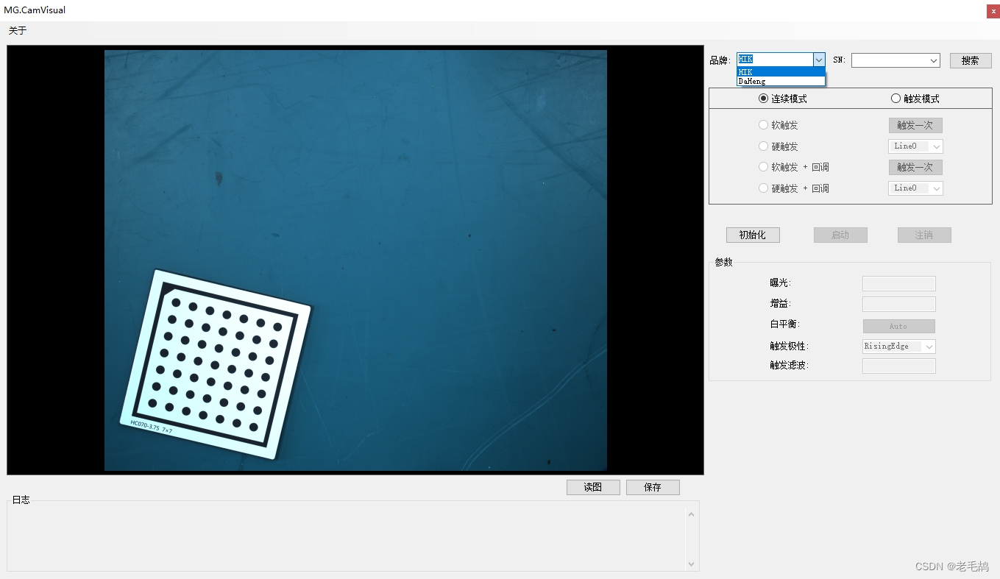

# C#  MG.CamCtrl 相机库（开源） 海康 大恒

### 创作不易，请:tw-2b50:支持

## 介绍

c# 工业相机库，含海康(HIK)、大恒、巴斯勒(Basler)等相机的常用功能。
底层采用回调+信号量模式封装 ，最大程度减小线程资源，提高采图效率。

 
  **功能持续完善中** 

  ****2025-02-10****
  1. 添加巴斯勒相机品牌(Basler)
  2. 接口优化
  3. 其他细节优化 
  
  ****2025-01-09****
  1. 海康相机(HIK)增加USB类型相机 
  2. 解决HIK内存占用过高问题 
  3. 其他细节优化 

 --- 

 --- 
 #### 注意事项 
 目标平台设置： x64

使用说明： [https://blog.csdn.net/qq_42239488/article/details/136568127](https://blog.csdn.net/qq_42239488/article/details/136568127)

